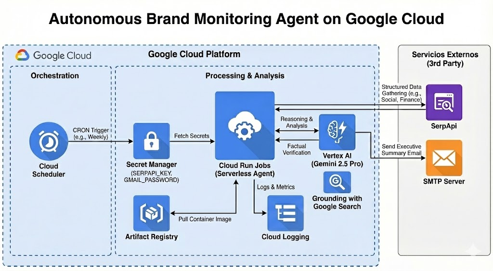

# Brand Monitoring & Market Intelligence Agent

An autonomous AI agent powered by **Google Gemini 2.5 Pro** and **Vertex AI Grounding** that monitors brand reputation, financial news, and social media sentiment. It generates professional, weekly executive summaries and delivers them via email.

## 🚀 Features

*   **Autonomous Monitoring**: Scans financial news and social media for brand mentions.
*   **AI Analysis**: Uses Gemini 2.5 Pro to analyze sentiment, urgency, and context.
*   **Grounding**: Verifies information using Google Search Grounding for accuracy.
*   **Professional Reporting**: Generates HTML email reports with color-coded sentiment analysis.
*   **Serverless Deployment**: Runs on Google Cloud Run Jobs with Cloud Scheduler.

## 🏗️ Architecture



*   **Core Logic**: Python 3.11 modular agent (`main.py`).
*   **AI Model**: Gemini 2.5 Pro (Vertex AI).
*   **Memory**: Google Cloud Firestore (Deduplication).
*   **Search**: Vertex AI Grounding + SerpApi (fallback/social).
*   **Compute**: Google Cloud Run (Serverless Jobs).
*   **Scheduling**: Google Cloud Scheduler (Weekly, Mondays at 8:00 AM Chile Time).
*   **Security**: Google Secret Manager for credentials.
*   **Notifications**: SMTP (Gmail) with HTML templating.

## 🛠️ Prerequisites

1.  **Google Cloud Platform Project** with billing enabled.
2.  **APIs Enabled**:
    *   Vertex AI API
    *   Cloud Run API
    *   Cloud Build API
    *   Secret Manager API
    *   Cloud Scheduler API
    *   Firestore API
3.  **gcloud CLI** installed and authenticated.
4.  **SerpApi Key** (for specialized search).
5.  **Gmail App Password** (for sending emails).

## 📦 Deployment Guide

### 1. Clone the Repository

```bash
git clone https://github.com/renierperez/bch-brand-agent.git
cd bch-brand-agent
```

### 2. Configure Environment

Ensure you have the following credentials ready:
*   `GMAIL_USER`: Your Gmail address.
*   `GMAIL_PASSWORD`: Your App Password.
*   `SERPAPI_KEY`: Your SerpApi key.

### 3. Deploy to Google Cloud

The repository includes a helper script `deploy_brand.sh` that handles:
*   Docker image build and push to Artifact Registry.
*   Secret creation in Secret Manager.
*   Cloud Run Job creation/update.
*   Cloud Scheduler configuration.

Run the deployment script:

```bash
# Make the script executable
chmod +x deploy_brand.sh

# Run deployment
./deploy_brand.sh
```

**Note**: You might need to adjust the `PROJECT_ID` and `REGION` variables in `deploy_brand.sh` or export them before running.

### 4. Manual Execution (Optional)

To trigger the job manually:

```bash
gcloud run jobs execute brand-monitoring-job --region us-central1
```

## 📝 Configuration

*   **Schedule**: Default is Mondays at 8:00 AM (Chile Time). Modify `deploy_brand.sh` to change.
*   **Prompts**: Edit `prompts/instructions.yaml` to adjust the analysis logic.
*   **Memory**: Deduplication logic is in `memory.py`, using Firestore collection `bch_processed_news`.
