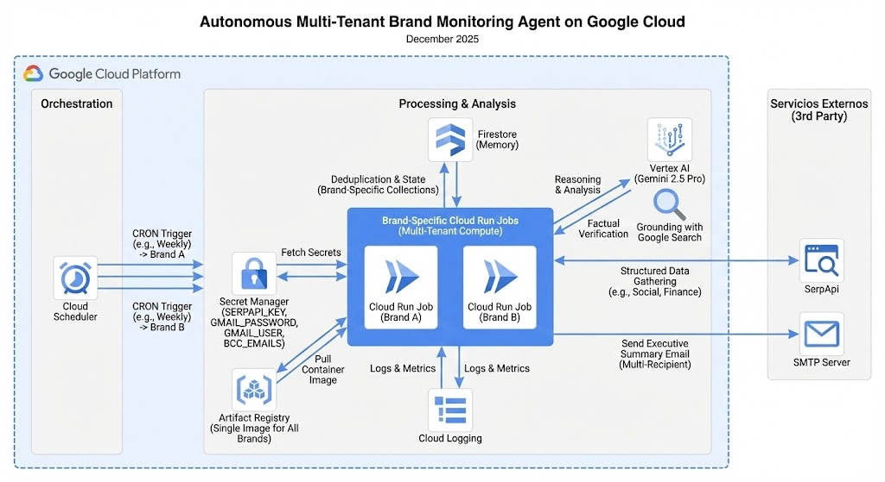

# Autonomous Brand Intelligence (ABI)

A **multi-tenant**, autonomous AI system powered by **Google Gemini 2.5 Pro** and **Vertex AI Grounding** that delivers real-time brand reputation monitoring, financial news analysis, and social media sentiment tracking for multiple organizations (e.g., Banco de Chile, BancoEstado).

## 🚀 Features (V5.0)

*   **Multi-Tenant Architecture**: Single codebase supporting multiple brands with isolated configurations and memories.
*   **Dynamic Branding**: Custom HTML headers, logos, and color schemes for each brand (e.g., Gothic style for Banco de Chile, Serif/Sans mix for BancoEstado).
*   **Expanded Intelligence**:
    *   **Social Media**: Monitors Twitter, LinkedIn, Facebook, Instagram, and Reddit via SerpApi.
    *   **Strategic Search**: Tracks executives, subsidiaries, and digital channels (Apps, Directories).
*   **AI Analysis**: Uses Gemini 2.5 Pro to analyze sentiment, urgency, and context, generating "Brand Health Index" scores.
*   **Grounding**: Verifies information using Google Search Grounding for accuracy.
*   **Professional Reporting**: Generates HTML email reports with "Executive Risk Summary" and "Tech Insights".
*   **Observability**: Detailed logging of search results and execution flow.

## 🏗️ Architecture



*   **Core Logic**: Python 3.11 modular agent (`main.py`).
*   **Configuration**: `brands_config.yaml` defines brand-specific settings (colors, search terms, competitors).
*   **AI Model**: Gemini 2.5 Pro (Vertex AI).
*   **Memory**: Google Cloud Firestore (Deduplication, isolated collections per brand).
*   **Search**: Vertex AI Grounding + SerpApi (Social Media & Financial News).
*   **Compute**: Google Cloud Run (Serverless Jobs, one per brand).
*   **Scheduling**: Google Cloud Scheduler (Weekly, Mondays at 8:00 AM Chile Time).
*   **Security**: Google Secret Manager for credentials (`GMAIL_PASSWORD`, `SERPAPI_KEY`).
*   **Notifications**: SMTP (Gmail) with robust BCC handling.

## 🛠️ Prerequisites

1.  **Google Cloud Platform Project** with billing enabled.
2.  **APIs Enabled**: Vertex AI, Cloud Run, Cloud Build, Secret Manager, Cloud Scheduler, Firestore.
3.  **gcloud CLI** installed and authenticated.
4.  **SerpApi Key** (for specialized search).
5.  **Gmail App Password** (for sending emails).

## 📦 Deployment Guide

### 1. Clone the Repository

```bash
git clone https://github.com/renierperez/bch-brand-agent.git
cd bch-brand-agent
```

### 2. Configure Environment

Ensure you have the following credentials stored in **Google Secret Manager**:
*   `GMAIL_USER`: Your Gmail address.
*   `GMAIL_PASSWORD`: Your App Password.
*   `SERPAPI_KEY`: Your SerpApi key.
*   `BCC_EMAILS`: Semicolon-separated list of BCC recipients (e.g., `user1@example.com;user2@example.com`).

The `deploy_multitenant.sh` script is configured to fetch these values directly from Secret Manager during deployment.

### 3. Deploy a Brand Agent

Use the `deploy_multitenant.sh` script to deploy an agent for a specific brand defined in `brands_config.yaml`.

**Usage:**
```bash
./deploy_multitenant.sh <BRAND_ID>
```

**Examples:**
```bash
# Deploy Banco de Chile Agent
./deploy_multitenant.sh banco_chile

# Deploy BancoEstado Agent
./deploy_multitenant.sh banco_estado
```

This script automatically:
1.  Builds the Docker image.
2.  Updates/Creates the Cloud Run Job for that brand.
3.  Configures environment variables and secrets.
4.  Sets up the Cloud Scheduler job.

## 📝 Configuration (`brands_config.yaml`)

Add or modify brands in `brands_config.yaml`:

```yaml
banco_chile:
  id: "banco_chile"
  name: "Banco de Chile"
  header_html: "..." # Custom HTML for email header
  search_terms:
    - "Banco de Chile"
    - "Esteban Kemp"
  primary_color: "#003399"
  secondary_color: "#FFFFFF"
  competitors: ["Santander", "Bci"]
  tech_focus: "Digital Transformation"

banco_estado:
  id: "banco_estado"
  ...
```

## 🧪 Testing & Utilities

### Reset Memory
To clear the agent's memory (Firestore) for ALL brands and force re-processing:

```bash
python3 reset_memory_multitenant.py
```

### Manual Execution
To trigger a specific brand's agent manually:

```bash
gcloud run jobs execute brand-agent-banco-chile --region us-central1
```
