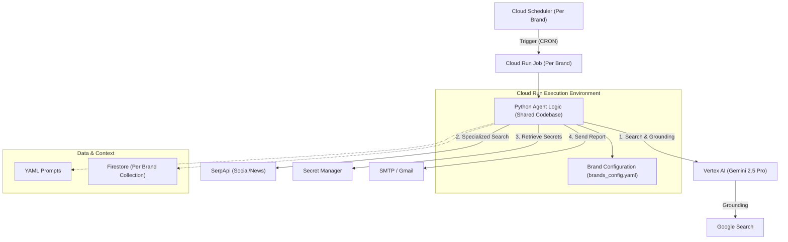

# Technical Guide: Building an Autonomous Multi-Tenant Brand Monitoring Agent on Google Cloud

**Target Audience:** Google Cloud Architects & Senior Developers
**Version:** 5.0
**Date:** December 2025

## 1. Executive Summary

This guide details the architecture and implementation of a serverless, autonomous **Multi-Tenant Brand Monitoring Agent**. The system leverages **Vertex AI Gemini 2.5 Pro** for reasoning and **Grounding with Google Search** for factual verification, orchestrating a workflow that monitors brand sentiment, analyzes financial news, and delivers actionable executive summaries via email for multiple organizations (e.g., Banco de Chile, BancoEstado) from a single codebase.

## 2. Solution Architecture

The solution is built on a **Serverless Event-Driven Architecture** to ensure scalability, low maintenance, and cost-efficiency. It uses a **Multi-Tenant** pattern where a single code repository serves multiple brands through configuration-driven deployments.

### 2.1 High-Level Diagram



### 2.2 Key Components

| Component | Purpose | Configuration Highlights |
| :--- | :--- | :--- |
| **Cloud Run Jobs** | Compute | One Job per Brand (e.g., `brand-agent-banco-chile`). Isolated execution. |
| **Vertex AI** | Intelligence | Model: `gemini-2.5-pro`. Feature: **Grounding with Google Search** for hallucination reduction. |
| **Cloud Scheduler** | Orchestration | CRON: `0 8 * * 1` (Weekly). Triggers specific brand jobs. |
| **Secret Manager** | Security | Stores `GMAIL_PASSWORD`, `SERPAPI_KEY`, `GMAIL_USER`, `BCC_EMAILS`. No hardcoded secrets. |
| **Firestore** | Memory | Deduplication logic using brand-specific collections (e.g., `banco_chile_processed_news`). |
| **Artifact Registry** | Delivery | Stores the single Docker container image used by all brand jobs. |

## 3. Implementation Details

### 3.1 Multi-Tenant Core (`main.py`)

The core agent is a Python application designed for multi-tenancy:

1.  **Dynamic Configuration**: Loads settings from `brands_config.yaml` based on the `BRAND_ID` environment variable.
    *   *Example*: `BRAND_ID=banco_chile` loads specific colors, search terms, and competitors.
2.  **Context Loading**: Loads persona (`persona.yaml`) and instructions (`instructions.yaml`).
3.  **Information Retrieval**:
    *   **Primary**: Vertex AI Grounding (Google Search).
    *   **Secondary**: `SerpApi` for social media (Twitter, LinkedIn, Reddit) and specific financial news.
4.  **Synthesis & Analysis**:
    *   Gemini 2.5 Pro generates an HTML report with brand-specific styling (e.g., Gothic header for Banco de Chile).
5.  **Delivery**:
    *   Sends emails via SMTP with robust BCC handling for multiple recipients.

### 3.2 Grounding Strategy

To ensure the "Executive Summary" is trustworthy, we implement **Grounding with Google Search**.

*   **Why?** LLMs can hallucinate. Grounding forces the model to cite sources.
*   **Implementation**:
    ```python
    tools = [Tool.from_dict({'google_search': {}})]
    model.generate_content(prompt, tools=tools)
    ```

## 4. Deployment Strategy

We use a **GitOps-style** approach with a consolidated deployment script (`deploy_multitenant.sh`).

### 4.1 Containerization

*   **Base Image**: `python:3.11-slim`.
*   **Single Image**: One Docker image serves all tenants.

### 4.2 Scripted Deployment

The `deploy_multitenant.sh` script handles the lifecycle of each brand's agent:

1.  **Build**: `gcloud builds submit` (only once/cached).
2.  **Deploy Job**: `gcloud run jobs update` for the specific brand.
    *   **Secrets Injection**: `GMAIL_USER`, `BCC_EMAILS`, etc., are mounted as environment variables from Secret Manager.
    *   **Env Vars**: Sets `BRAND_ID` to identify the tenant.
3.  **Schedule**: Creates/Updates a Cloud Scheduler job targeting the specific Cloud Run Job.

## 5. Security Best Practices

1.  **Identity & Access Management (IAM)**:
    *   The Cloud Run Service Account must have `Vertex AI User`, `Secret Manager Secret Accessor`, and `Datastore User`.
2.  **Secret Management**:
    *   **ALL** sensitive data (`GMAIL_USER`, `BCC_EMAILS`, keys) is stored in Secret Manager.
    *   Injected at runtime via `--set-secrets`.
3.  **Isolation**:
    *   Each brand runs in its own isolated Cloud Run Job execution.
    *   Memory (Firestore) is separated by collection names.

## 6. Monitoring & Observability

*   **Cloud Logging**: Captures agent output, including verbose SerpApi search results.
*   **Key Metrics**:
    *   *Job Success*: Monitor exit codes (0 = Success).
    *   *Email Delivery*: Logs confirm "Email sent successfully".

## 7. Future Extensibility

*   **Instant Alerts**: Add a "Crisis Mode" triggered by Pub/Sub for real-time negative sentiment.
*   **Dashboard**: Build a Looker Studio dashboard on top of Firestore data for historical trends.
